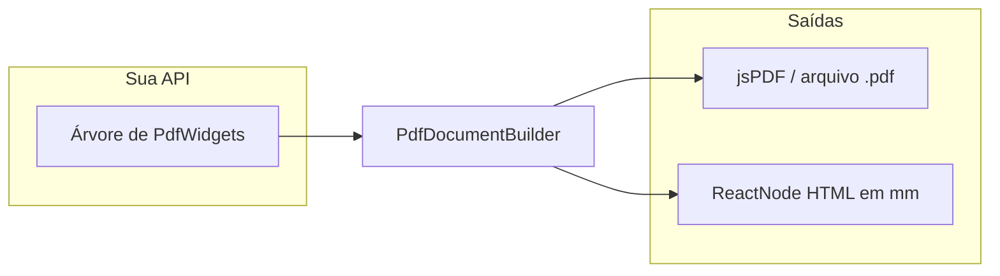

<div align="center">

# WidgetPDF

**PDF declarativo para React — pense em widgets, não em coordenadas.**

Construa documentos com uma árvore de componentes inspirada no **Flutter** (`Column`, `Row`, `Padding`, `Container`…), gere o arquivo com **jsPDF** e veja o **mesmo layout no navegador** com pré-visualização em React.

[](https://www.npmjs.com/package/@italo-git/widgetpdf)
[](LICENSE)
[](https://react.dev/)

</div>

**Índice:** [Conceitos](#conceitos) · [Tutorial](#tutorial-passo-a-passo) · [PdfDocumentBuilder](#pdfdocumentbuilder) · [`PdfHtmlPreview`](#pdfhtmlpreview) · [Widgets](#documentação-dos-widgets) · [Tipos e tema](#tipos-e-tema) · [Utilitários](#utilitários) · [Pré-visualização](#pré-visualização-e-helpers-html) · [Limitações](#limitações-atuais-mvp)

---

## Por que WidgetPDF?

| Abordagem tradicional         | Com WidgetPDF                                                     |
| ----------------------------- | ----------------------------------------------------------------- |
| Chamar `doc.text(x, y)` à mão | Descrever **o que** vai na página em **widgets**                  |
| PDF e UI divergem             | **Uma árvore** → PDF **e** HTML alinhados em **mm**               |
| Mental model de canvas        | Mental model próximo ao **Flutter**: constraints, layout, pintura |

A biblioteca separa o trabalho em duas fases:

1. **`layout(doc, constraints)`** — cada widget calcula seu `Size` (largura/altura em **mm**) dentro das restrições do pai.
2. **`paint(ctx)`** — desenha no `jsPDF` na caixa `(x, y, width, height)` com origem **topo-esquerdo** e **Y para baixo** (igual ao modelo usado internamente no fluxo de pintura).

Para pré-visualização no React, cada widget implementa **`toHtml(options)`**, gerando um `ReactNode` com **mesmas ideias de medida** (`maxWidthMm` / `maxHeightMm` em mm).



---

## Conceitos

- **Unidades:** tudo é pensado em **milímetros (mm)** no `PdfDocumentBuilder` e nos widgets (coerente com `jsPDF` em `unit: "mm"`).
- **Raiz:** você passa **um único** `PdfWidget` para `PdfDocumentBuilder`. Normalmente é um `PdfColumn`, `PdfPadding` ou `PdfContainer` que envolve o restante.
- **Filhos:** não é JSX — são **instâncias** (`new PdfText(...)`, `new PdfColumn({ children: [...] })`). A árvore é montada no código TypeScript/JavaScript.
- **Alinhamentos** (como no Flutter):
  - **Eixo principal** (`mainAxisAlignment`): na `PdfColumn` é **vertical**; na `PdfRow` é **horizontal**. Valores: `start`, `center`, `end`, `spaceBetween`, `spaceAround`.
  - **Eixo cruzado** (`crossAxisAlignment`): na coluna é **horizontal**; na linha é **vertical**. Valores: `start`, `center`, `end`, `stretch`.

---

## Tutorial passo a passo

### 1. Instalar dependências

Basta um comando — **React**, **React DOM**, **jsPDF** e tipos TypeScript vêm como dependências do pacote:

```bash
npm install @italo-git/widgetpdf
```

Em aplicações que já listam `react` no `package.json`, o npm costuma **deduplicar** para uma única cópia quando as versões são compatíveis.

### 2. Hello PDF — só texto em coluna

```tsx
import { PdfDocumentBuilder, PdfColumn, PdfText } from "@italo-git/widgetpdf";

const root = new PdfColumn({
  spacing: 8,
  children: [
    new PdfText("Olá, mundo PDF"),
    new PdfText("Segunda linha", { fontSize: 10 }),
  ],
});

const builder = new PdfDocumentBuilder(root);
builder.save("hello.pdf");
```

### 3. Margens + padding — espaçamento confortável

Use **`marginsAll`** nas opções do builder (área útil da página) e **`PdfPadding`** + **`edgeInsetsAll`** (ou `edgeInsetsSymmetric`) para afastar o conteúdo das bordas da área útil.

```tsx
import {
  PdfDocumentBuilder,
  PdfColumn,
  PdfText,
  PdfPadding,
  marginsAll,
  edgeInsetsAll,
} from "@italo-git/widgetpdf";

const builder = new PdfDocumentBuilder(
  new PdfPadding(
    edgeInsetsAll(12),
    new PdfColumn({
      spacing: 6,
      children: [
        new PdfText("Título", { fontSize: 16, fontStyle: "bold" }),
        new PdfText("Corpo do documento."),
      ],
    }),
  ),
  { margins: marginsAll(14) },
);
builder.save("com-margens.pdf");
```

### 4. Linha e coluna — cabeçalho com título e data

```tsx
import {
  PdfDocumentBuilder,
  PdfColumn,
  PdfRow,
  PdfText,
  PdfSizedBox,
} from "@italo-git/widgetpdf";

const header = new PdfRow({
  mainAxisAlignment: "spaceBetween",
  crossAxisAlignment: "center",
  children: [
    new PdfText("Nota fiscal", { fontSize: 14, fontStyle: "bold" }),
    new PdfText("20/03/2025", { fontSize: 10 }),
  ],
});

const root = new PdfColumn({
  spacing: 10,
  children: [
    header,
    new PdfSizedBox({ height: 4 }), // espaço vertical “fixo”
    new PdfText("Detalhes abaixo."),
  ],
});

new PdfDocumentBuilder(root).save("layout-row.pdf");
```

### 5. Caixa com fundo e borda — `PdfContainer`

```tsx
import {
  PdfDocumentBuilder,
  PdfColumn,
  PdfText,
  PdfContainer,
  edgeInsetsAll,
  PDF_THEME,
} from "@italo-git/widgetpdf";

const root = new PdfColumn({
  spacing: 8,
  children: [
    new PdfContainer({
      padding: edgeInsetsAll(4),
      decoration: {
        fillColor: PDF_THEME.base,
        strokeColor: PDF_THEME.detalhes,
        borderRadius: 2,
        lineWidth: 0.3,
      },
      child: new PdfText("Destaque em caixa."),
    }),
  ],
});

new PdfDocumentBuilder(root).save("container.pdf");
```

### 6. Pré-visualização na interface React

A forma mais direta em TSX é o componente **`PdfHtmlPreview`** (definido em [`src/render_component.tsx`](src/render_component.tsx)): ele recebe o **mesmo** `PdfWidget` raiz que você usaria no `PdfDocumentBuilder`, aplica margens/orientação/formato opcionais e devolve a folha em mm — com `className` opcional que envolve tudo num `div` com o atributo `data-pdf-html-preview` para estilizar ou testes.

```tsx
import { PdfHtmlPreview, PdfColumn, PdfText, marginsAll } from "@italo-git/widgetpdf";

const root = new PdfColumn({
  children: [new PdfText("Preview em tempo real")],
});

export function PdfPreviewCard() {
  return (
    <div
      style={{
        maxWidth: "100%",
        overflow: "auto",
        boxShadow: "0 4px 24px rgba(0,0,0,0.12)",
        borderRadius: 8,
      }}
    >
      <PdfHtmlPreview root={root} margins={marginsAll(14)} className="minha-folha-preview" />
    </div>
  );
}
```

**Alternativa:** instancie `PdfDocumentBuilder` e chame `toHtmlPreview()` — é o que `PdfHtmlPreview` usa por baixo dos panos.

```tsx
const previewBuilder = new PdfDocumentBuilder(root, { margins: marginsAll(14) });
// …
{previewBuilder.toHtmlPreview()}
```

Para **zoom** na tela, aplique `transform: scale(0.5)` no wrapper externo (o conteúdo continua em mm dentro do `div` da “folha”).

---

## PdfDocumentBuilder

Monta o documento a partir de **um único widget raiz** (`PdfWidget`).

### Construtor

```ts
new PdfDocumentBuilder(root: PdfWidget, options?)
```

| Opção `options` | Tipo                                      | Padrão           | Descrição                                                                                                    |
| --------------- | ----------------------------------------- | ---------------- | ------------------------------------------------------------------------------------------------------------ |
| `margins`       | `PdfMargins`                              | `marginsAll(14)` | Margens da página em **mm** (topo, direita, fundo, esquerda). Reduz a área útil passada ao `layout` da raiz. |
| `orientation`   | `"p" \| "portrait" \| "l" \| "landscape"` | `"p"`            | Orientação da página.                                                                                        |
| `format`        | `string \| [number, number]`              | `"a4"`           | Formato jsPDF (ex.: `"a4"`), ou largura/altura customizadas.                                                 |

### Métodos

| Método                   | Retorno     | Descrição                                                                                                   |
| ------------------------ | ----------- | ----------------------------------------------------------------------------------------------------------- |
| `build()`                | `jsPDF`     | Executa `layout` na raiz e `paint` com área útil; devolve o documento para você usar `save`, `output`, etc. |
| `save(filename: string)` | `void`      | Atalho: `build().save(filename)`.                                                                           |
| `toHtmlPreview()`        | `ReactNode` | Folha em mm + margens + conteúdo HTML gerado pela árvore (para pré-visualização).                           |

---

## `PdfHtmlPreview`

Componente de pré-visualização em React (fonte: [`src/render_component.tsx`](src/render_component.tsx)). Encapsula `new PdfDocumentBuilder(root, opts).toHtmlPreview()` e, se `className` for passado, envolve o resultado num `<div className={...} data-pdf-html-preview>`.

```tsx
function PdfHtmlPreview(props: {
  root: PdfWidget
  margins?: PdfMargins
  orientation?: "p" | "portrait" | "l" | "landscape"
  format?: string | [number, number]
  className?: string
}): ReactNode
```

| Prop            | Descrição                                                                 |
| --------------- | ------------------------------------------------------------------------- |
| `root`          | Widget raiz da árvore (obrigatório).                                      |
| `margins`       | Mesmas regras do `PdfDocumentBuilder` (padrão interno: `marginsAll(14)`). |
| `orientation`   | Retrato ou paisagem.                                                      |
| `format`        | Ex.: `"a4"` ou `[largura, altura]` em unidades do jsPDF.                   |
| `className`     | Se definido, o preview fica dentro de um `div` extra com esse nome.       |

Sem `className`, o retorno é o `ReactNode` “cru” da folha (igual a `toHtmlPreview()`), útil para embutir sem wrapper extra.

---

## Documentação dos widgets

Todos estendem `PdfWidget` e implementam `layout`, `paint` e `toHtml`.

### `PdfText`

Texto com quebra automática conforme a largura máxima disponível (usa `splitTextToSize` do jsPDF).

```ts
new PdfText(text: string, opts?)
```

| `opts`      | Tipo                             | Padrão     | Descrição                               |
| ----------- | -------------------------------- | ---------- | --------------------------------------- |
| `fontSize`  | `number`                         | `12`       | Tamanho em **pt** (coerente com jsPDF). |
| `fontStyle` | `"normal" \| "bold" \| "italic"` | `"normal"` | Estilo da fonte Helvetica.              |
| `color`     | `Rgb`                            | preto      | `[r, g, b]` com valores **0–255**.      |

---

### `PdfSizedBox`

Reserva tamanho e/ou limita o filho. Sem filho, funciona como **espaço vazio** (largura/altura podem ser `0`).

```ts
new PdfSizedBox({ width?, height?, child? })
```

| Campo              | Descrição                                                                        |
| ------------------ | -------------------------------------------------------------------------------- |
| `width` / `height` | Em **mm**. Se definidos, influenciam o tamanho do box e as constraints do filho. |
| `child`            | Widget opcional desenhado dentro da caixa.                                       |

---

### `PdfPadding`

Aplica **padding** uniforme ou assimétrico ao redor de um único filho.

```ts
new PdfPadding(padding: EdgeInsets, child: PdfWidget)
```

Use `edgeInsetsAll(n)` ou `edgeInsetsSymmetric({ vertical, horizontal })` para construir `EdgeInsets`.

---

### `PdfContainer`

Como um `Padding` + **decoração** opcional: fundo, borda e cantos arredondados (no PDF via `rect` / `roundedRect`).

```ts
new PdfContainer({
  padding?: EdgeInsets,  // default: 0 em todos os lados
  decoration?: PdfDecoration,
  child: PdfWidget,
})
```

**`PdfDecoration`:**

| Campo          | Descrição                                      |
| -------------- | ---------------------------------------------- |
| `fillColor`    | `Rgb` — preenchimento do retângulo.            |
| `strokeColor`  | `Rgb` — cor da borda.                          |
| `borderRadius` | Número em **mm**; se `> 0`, usa `roundedRect`. |
| `lineWidth`    | Espessura da borda em **mm** (padrão ~`0.2`).  |

---

### `PdfColumn`

Empilha filhos na **vertical**. Espaçamento extra entre itens via `spacing` (mm). Distribui espaço livre no eixo vertical com `mainAxisAlignment`.

```ts
new PdfColumn({
  children: PdfWidget[],
  spacing?: number,                    // default: 0
  mainAxisAlignment?: MainAxisAlignment,
  crossAxisAlignment?: CrossAxisAlignment,
})
```

- Com `crossAxisAlignment: "stretch"`, a largura dos filhos segue a largura da coluna.
- `maxHeight` nas constraints, quando existe, limita a altura total e pode ativar scroll na pré-visualização HTML.

---

### `PdfRow`

Coloca filhos na **horizontal**. `spacing` em **mm** entre adjacentes. `mainAxisAlignment` distribui espaço **horizontal** livre; `crossAxisAlignment` alinha no **vertical** do rio.

```ts
new PdfRow({
  children: PdfWidget[],
  spacing?: number,
  mainAxisAlignment?: MainAxisAlignment,
  crossAxisAlignment?: CrossAxisAlignment,
})
```

- Com `crossAxisAlignment: "stretch"` e altura máxima definida, a linha usa essa altura e estica filhos conforme o layout.

---

### `PdfWidget` (classe abstrata)

Base para composição própria: subclasse e implemente `layout`, `paint` e `toHtml`. Útil para componentes reutilizáveis (logotipo, carimbo, etc.).

---

## Tipos e tema

| Nome                 | Significado                                                                               |
| -------------------- | ----------------------------------------------------------------------------------------- |
| `Rgb`                | Tupla `[r, g, b]` com valores **0–255**.                                                  |
| `MainAxisAlignment`  | `"start"` \| `"center"` \| `"end"` \| `"spaceBetween"` \| `"spaceAround"`.                |
| `CrossAxisAlignment` | `"start"` \| `"center"` \| `"end"` \| `"stretch"`.                                        |
| `Constraints`        | `{ maxWidth: number; maxHeight?: number }` — em **mm**.                                   |
| `Size`               | `{ width: number; height: number }` — em **mm**.                                          |
| `PaintContext`       | `{ doc, x, y, width, height }` — contexto de pintura para `paint`.                        |
| `EdgeInsets`         | `{ top, right, bottom, left }` — em **mm**.                                               |
| `PdfMargins`         | Igual estrutura a `EdgeInsets`, usado nas margens da página no builder.                   |
| `HtmlPreviewOptions` | `{ maxWidthMm: number; maxHeightMm?: number }` — passado internamente na árvore `toHtml`. |
| `PdfDecoration`      | Ver secção `PdfContainer`.                                                                |

### `PDF_THEME`

Constante com três cores RGB de exemplo (alinhadas a variáveis CSS em um app típico):

- `detalhes` — destaque/accente
- `base` — fundo suave
- `auxiliar` — texto preto

---

## Utilitários

| Função                                              | Uso                                                                                     |
| --------------------------------------------------- | --------------------------------------------------------------------------------------- |
| `marginsAll(value: number): PdfMargins`             | Margens iguais nos quatro lados para o `PdfDocumentBuilder`.                            |
| `edgeInsetsAll(value: number): EdgeInsets`          | Padding simétrico para `PdfPadding` / `PdfContainer`.                                   |
| `edgeInsetsSymmetric({ vertical?, horizontal? })`   | Padding vertical/horizontal separado.                                                   |
| `deflateConstraints(constraints, padding)`          | Calcula constraints **internas** após descontar padding (útil em widgets customizados). |
| `measureTextBlock(doc, text, maxWidth, fontSizePt)` | Retorna `{ lines, width, height }` para medir texto com o mesmo critério do `PdfText`.  |

---

## Pré-visualização e helpers HTML

Para a pré-visualização integrada na app, prefira **`PdfHtmlPreview`** (secção anterior) ou `PdfDocumentBuilder.toHtmlPreview()`.

Funções exportadas para quem monta UI própria ou estende widgets e quer espelhar **flexbox** / **cores**:

| Função                           | Descrição                                             |
| -------------------------------- | ----------------------------------------------------- |
| `rgbToCss(rgb)`                  | `"rgb(r, g, b)"` para `style` em React.               |
| `edgeInsetsToCssPadding(p)`      | String CSS `top right bottom left` em **mm**.         |
| `mainAxisToJustifyContent(main)` | Mapeia `MainAxisAlignment` → `justifyContent` do CSS. |
| `crossAxisToAlignItems(cross)`   | Mapeia `CrossAxisAlignment` → `alignItems` do CSS.    |

---

## Limitações atuais (MVP)

- **Sem quebra automática de página** — conteúdo longo pode ultrapassar a página; divida em blocos ou páginas manualmente.
- A pré-visualização HTML **aproxima** o PDF (medidas e flex em mm); não garante pixel idêntico ao render do jsPDF.

---

## Licença

[ISC](LICENSE) — Italo Monteiro Leite.

---

<div align="center">

**WidgetPDF** — _do widget ao PDF, sem perder o desenho da sua interface._

[Issues](https://github.com/TyranoT/WidgetPDF/issues) · [Repositório](https://github.com/TyranoT/WidgetPDF)

</div>
